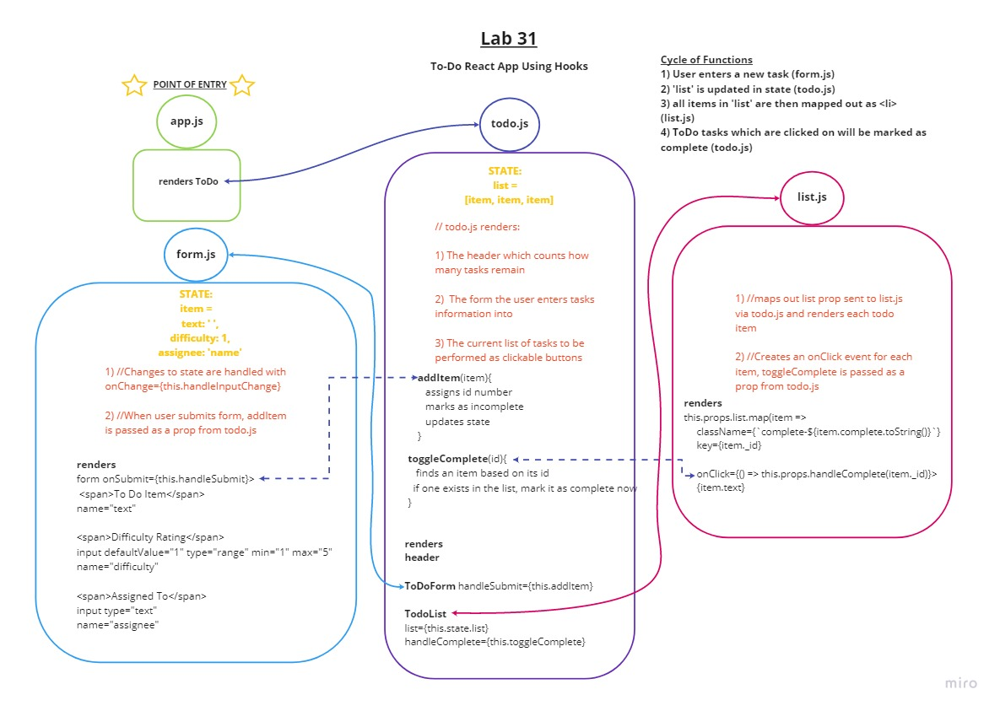

# Lab 34: `<Login />` and `<Auth />`

- https://github.com/micgreene/todo-/pull/2

Codefellows 401 JavaScript

## Overview

- React App: Upgrading functionality of working React App to Conditional Rendering Using Authentication

- **Business Requirements**

- The To Do Manager application has the following overall requirements:

  - Designed to match the mock-up
  - Header, Main Section Footer
  - Use React Bootstrap for styling and visual components
  - The header should present the application title and main menu Home Link, which shows the list of To Do Items as noted below
  
  - A Login/Register/User section
  - When a user is not logged in:
    - Show Login and Register links
    - Login: Renders a Login Form
    - Register: Renders a new user registration form
    - Require Fields:: Username, Password, Email, Role
  
  - When a user is logged in:
    - Show “Welcome username”
    - Show a “Logout” link
  - When clicked, this should remove any cookies you have set and remove access

  - In the “Main” section
    - Nothing should be visible until a user has logged in successfully
    - The list of items in the to do list
    - Based on user preferences, show listings in groups of (5, 10, etc) and provide the ability to view multiple “pages” of results
    - Each item in list should show the text of the item as well as the assignee
    - Based on user preferences, hide or show completed items
      - If shown, completed items should be styled differently making their status visually obvious

  - For users with “Update” permissions
    - When an item is clicked, toggle the “complete” status of the item.

  - For users with “Delete” permissions
    - Items should have a delete button associated with them
    - When clicked, remove the item from the list

  - For users with “Create” permissions …
    - A Form where the user can a new item to the todo list
    - Items should have the following fields:
      - To Do Item Text
      - Assigned To
      - Status (complete/incomplete)
      - Difficulty (number between 1 and 5)

- **Technical Requirements**

- The application will be created with the following overall architecture and methodologies:
  - React
  - ES6 Classes
  - Settings delivered to the application using Context
  - User Login & Permissions delivered to the application using Context
  - Local Storage / Cookies for storing login status
  - Local Storage / Cookies for storing user preferences
  - Superagent or Axios for performing API Requests
  - React Bootstrap for styling
  - Test Driven Development, using Jest
  - Tests will be runnable locally
  - Deployment to cloud provider

- **Development Process, Milestones**
- Phase 1: Application Setup
  - Basic To Do List Management, using Hooks

- Phase 2: Persistence
  - Implement a custom Form Hook
  - Implement a custom Ajax Hook
  - Connect to a live API for storing To Do Items

- Phase 3: Settings and Global Context
  - Implement user settings for displaying items

- Phase 4: Authorization
  - Require a login to access the list
  - Restrict access to adding, editing, deleting to certain user types

### Authors

- Mike Greene

### Links and Resources

- local server: http://localhost:3000/

#### `.env` requirements (where applicable)

- REACT_APP_API=https://api-js401.herokuapp.com
- REACT_APP_API_SECRET=***********

### UML

